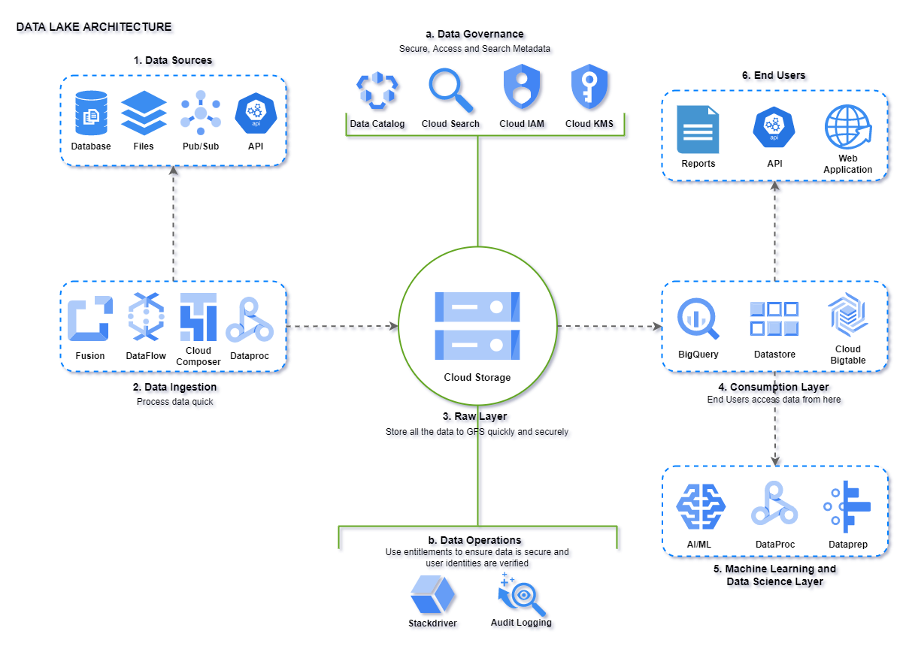

# cerc-data-architecture-challenge

Cerc Data Architecture Challenge é um desafio de engenharia de dados elaborado pela CERC SA.

## Desafio
* Com base em seu conhecimento e pesquisa, realize o desenho de uma arquitetura proposta para criação de
um Data Lake.
* O desenho pode ser com tecnologias on-premises ou cloud Servers.
* Neste processo, sugira quais camadas no seu ponto de vista são necessárias para trafegar os dados e o
disponibilizar para a empresa. Pense em camada(s) para o time de de DataScience trabalhar.
* Ao final, disponibilize o resultado do desenho e os detalhes com os pontos fortes e fracos da sua sugestão de
arquitetura.
* Algumas dicas, mas não que seja um roteiro, pense em aquisição, tratamento, armazenamento e disponibilização dos dados.

## Solução

Para a solução do desafio decidi usar como referência uma infraestrutura 100% cloud, sendo mais direto escolhi o Google Cloud Plataform (GCP).

Minha solução contempla dois desenhos de arquitetura, um com uma visão mais ampla e genérica e outro representando um caso mais específico.

## Diagrama 1

Diagrama elaborado com a ferramenta [Draw.io](https://www.diagrams.net/)

O diagrama acima mostra como diferentes serviços gerenciados pelo Google podem ser usados ​​e integrados para torná-lo um data lake completo e escalável. Você pode adicionar e remover certas ferramentas com base nos casos de uso, mas a implementação do data lake gira principalmente em torno desses conceitos.

#### Abaixo a descrição das camadas.

1. **Data Source**: Os dados podem vir de várias fontes de dados e o data lake deve ser capaz de lidar com todos os dados recebidos.

2. **Ingestion**: Coletar e processar os dados recebidos de várias fontes de dados é a parte crítica de qualquer implementação de data lake bem-sucedida. Esta é realmente a etapa mais demorada e intensiva de recursos.

3. **Raw Layer**: O armazenamento de objetos é fundamental para qualquer implementação de data lake. O Cloud Storage serve como camada bruta. Você pode criar uma camada bruta de data lake altamente escalável e altamente disponível usando o Cloud Storage, que também fornece SLAs muito altos.
Existem também diferentes classes de armazenamento de objetos, como multirregional, regional, coldline e nearline, que podem ser usados ​​para diferentes propósitos com base nos requisitos.

4. **Consumption layer**: Todos os itens mencionados anteriormente são internos ao data lake e não serão expostos para usuários externos. A camada de consumo é onde você armazena dados selecionados e processados ​​para consumo do usuário final. Os aplicativos do usuário final podem ser relatórios, aplicativos da web, extrações de dados ou APIs.

5. **Machine Learning and Data Science**: As equipes de aprendizado de máquina e ciência de dados são os maiores consumidores dos dados do data lake. Eles usam esses dados para treinar seus modelos, prever e usar os modelos treinados para aplicar para futuras variáveis ​​de dados.

## Diagrama 2

Diagrama elaborado com a ferramenta [Draw.io](https://www.diagrams.net/)

No diagrama 2 utilizei apenas alguns dos recursos disponíveis no GCP para montar um caso de uso. Abaixo vou descrever cada recurso utilizado nas camadas representadas.

* **Pub/Sub**: Está representando apenas a origem do dado no formato de streaming.

* **Dataproc**: O Cloud Dataproc é um serviço gerenciado do Google para o eco sistema Hadoop/Spark.

* **Cloud Storage**:  O Cloud Storage serve como camada bruta. Você pode criar uma camada bruta de data lake altamente escalável e altamente disponível usando o Cloud Storage.

* **BigQuery**: O BigQuery é uma parte importante da pilha de data lake do Google. É um banco de dados de data warehouse, serviço gerenciado sem servidor e pode ser dimensionado em petabytes de dados. O BigQuery é muito bom para consultas analíticas em que você usa muitas agregações e cálculos.O BigQuery também vem com recursos de mecanismo de ML, GIS e BI. 

* **Cloud IA Platform**: Use o AI Platform para treinar os modelos de machine learning em escala, hospedar modelos treinados na nuvem, e fazer previsões sobre novos dados. Aqui é onde o time de Data Science irá trabalhar.

* **Reports/API/WebApplication**: Representam exemplos de usuários finais que podem acessar os dados via BigQuery.

## Alguns pontos em relação ao desenho proposto (Diagrama 2)

No diagrama 2 proposto, acredito que na camada 4 (Consumption Layer) o recurso ideal seria o Cloud BigTable, pois é muito bom para leitura/gravação de alto rendimento e necessidades de banco de dados de baixa latência (sub 10ms). Alguns dos casos de uso do BigTable são streaming, dados de séries temporais, tecnologia de anúncios, fintech e assim por diante que é exatamente o cenário proposto mas infelizmente ele não tem integração com o Cloud IA Platform que é essencial para o time de Data Science trabalhar. Por outro lado, financeiramente falando o BigTable é mais caro em comparação com BigQuery.

Um ponto muito forte do diagrama proposto é o fato de conseguirmos encaixar num fluxo de Data Lake uma plataforma de Inteligência Artificial e Machine Learning onde os cientistas poderão trabalhar com os dados e consequentemente impulsionar a área e gerar mais insights para a organização.

